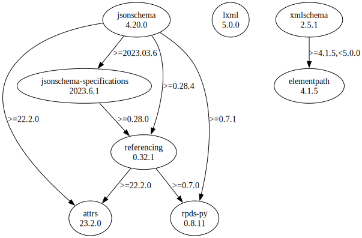

# Third Party Dependencies

<!--[[[fill sbom_sha256()]]]-->
The [SBOM in CycloneDX v1.4 JSON format](https://git.sr.ht/~sthagen/csaf-lint/blob/default/sbom/cdx.json) with SHA256 checksum ([11bd2d40 ...](https://git.sr.ht/~sthagen/csaf-lint/blob/default/sbom/cdx.json.sha256 "sha256:11bd2d404ded0236bb95729289137625e48899b22be181930f9b6e0112147ff3")).
<!--[[[end]]] (checksum: 78b095a567ca38413c33c7ac381769a8)-->
## Licenses

JSON files with complete license info of: [direct dependencies](direct-dependency-licenses.json) | [all dependencies](all-dependency-licenses.json)

### Direct Dependencies

<!--[[[fill direct_dependencies_table()]]]-->
| Name                                                          | Version                                               | License     | Author                     | Description (from packaging data)                                                                |
|:--------------------------------------------------------------|:------------------------------------------------------|:------------|:---------------------------|:-------------------------------------------------------------------------------------------------|
| [attrs](https://www.attrs.org/en/stable/changelog.html)       | [23.1.0](https://pypi.org/project/attrs/23.1.0/)      | MIT License | Hynek Schlawack <hs@ox.cx> | Classes Without Boilerplate                                                                      |
| [jsonschema](https://github.com/python-jsonschema/jsonschema) | [4.18.2](https://pypi.org/project/jsonschema/4.18.2/) | MIT License | Julian Berman              | An implementation of JSON Schema validation for Python                                           |
| [lxml](https://lxml.de/)                                      | [4.9.3](https://pypi.org/project/lxml/4.9.3/)         | BSD License | lxml dev team              | Powerful and Pythonic XML processing library combining libxml2/libxslt with the ElementTree API. |
| [xmlschema](https://github.com/sissaschool/xmlschema)         | [2.3.1](https://pypi.org/project/xmlschema/2.3.1/)    | MIT License | Davide Brunato             | An XML Schema validator and decoder                                                              |
<!--[[[end]]] (checksum: a1370fe9e296694e2f00946eb504ef21)-->

### Indirect Dependencies

<!--[[[fill indirect_dependencies_table()]]]-->
| Name                                                      | Version                                               | License     | Author            | Description (from packaging data)                                    |
|:----------------------------------------------------------|:------------------------------------------------------|:------------|:------------------|:---------------------------------------------------------------------|
| [elementpath](https://github.com/sissaschool/elementpath) | [4.1.2](https://pypi.org/project/elementpath/4.1.2/)  | MIT License | Davide Brunato    | XPath 1.0/2.0/3.0/3.1 parsers and selectors for ElementTree and lxml |
| [pyrsistent](https://github.com/tobgu/pyrsistent/)        | [0.19.2](https://pypi.org/project/pyrsistent/0.19.2/) | MIT License | Tobias Gustafsson | Persistent/Functional/Immutable data structures                      |
<!--[[[end]]] (checksum: f8a34c2dbbb805acfac36a04ea719070)-->

## Dependency Tree(s)

JSON file with the complete package dependency tree info of: [the full dependency tree](package-dependency-tree.json)

### Rendered SVG

Base graphviz file in dot format: [Trees of the direct dependencies](package-dependency-tree.dot.txt)



### Console Representation

<!--[[[fill dependency_tree_console_text()]]]-->
````console
jsonschema==4.18.2
├── attrs [required: >=22.2.0, installed: 23.1.0]
├── jsonschema-specifications [required: >=2023.03.6, installed: 2023.6.1]
│   └── referencing [required: >=0.28.0, installed: 0.29.1]
│       ├── attrs [required: >=22.2.0, installed: 23.1.0]
│       └── rpds-py [required: >=0.7.0, installed: 0.8.10]
├── referencing [required: >=0.28.4, installed: 0.29.1]
│   ├── attrs [required: >=22.2.0, installed: 23.1.0]
│   └── rpds-py [required: >=0.7.0, installed: 0.8.10]
└── rpds-py [required: >=0.7.1, installed: 0.8.10]
lxml==4.9.3
xmlschema==2.3.1
└── elementpath [required: >=4.1.2,<5.0.0, installed: 4.1.2]
````
<!--[[[end]]] (checksum: dba73d4cae9fed64046129d5da3e576f)-->
